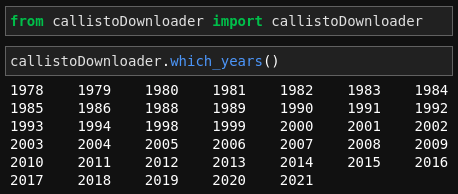

# callistoDownloader

[](https://badge.fury.io/py/callistoDownloader)

A python package for downloading spectrograms sourced from the [e-Callisto](http://www.e-callisto.org), which is an international network of solar radio spectrometers.

This package allows for bulk downloads of spectrograms for a given set of days in a given month and year, for a list of given instruments (visit [link](http://soleil.i4ds.ch/solarradio/data/readme.txt) for a list of all instruments from which the data is sourced).

The downloads are structured within a <code>e-Callisto</code> directory inside the working directory. The same is illustrated below:


```
working directory/
└───e-Callisto/
    └───yyyy/
        └───mm/
            └───dd/
                └───file1..
                    file2..
```

## Example




## Functions of this package:
- `which_years()`
<br>Prints all those years for which any spectrograms are available

- `which_months(select_year)`
<br>Prints all those months of a given year for which spectrograms are available

- `which_days(select_year, select_month)`
<br>Prints all those days of a given year and month for which spectrograms are available

- `instrument_codes()`
<br> Prints instructions for choosing `instruments` parameter in `download()`

- `download(select_year, select_month, select_day, instruments)`
<br>Downloads the spectrograms for given list of days of a given year and month; for set of instruments
## Argument rules:

- `select_year`
<br> must be a valid 4-digit integer

- `select_month`
<br> must be a valid integer

- `select_day`
<br> could either be a valid integer or a list of valid integers

- `instruments` 
<br> could be either a single *instrument code*[^1] or a wildcard string ending with an asterisk indicating to download all the files which start with the wildcard string.
<!-- <br> Refer documentation for *instrument codes* -->

[^1]: *Instrument codes* is a list of codes derived specifically for this package and each code corresponds to one of the instrument-location combination from [link](http://soleil.i4ds.ch/solarradio/data/readme.txt). The text before the first hyphen in a file name is the *instrument code*.

<hr>

Example for the `instruments` parameter:

See [link](http://soleil.i4ds.ch/solarradio/data/readme.txt) and if you would want to download all files from **Mauritius**, then the argument for `instruments` would be `MRT*` but if you would want to download only the data from Callisto intensity 45 MHz-870 MHz	of Poste de Flacq, Mauritius, LPDA, then that argument would be `MRT1`. 

If the `instruments` argument of the `download()` function ends with an asterisk, all the files from a given date which start with the argument are downloaded.


